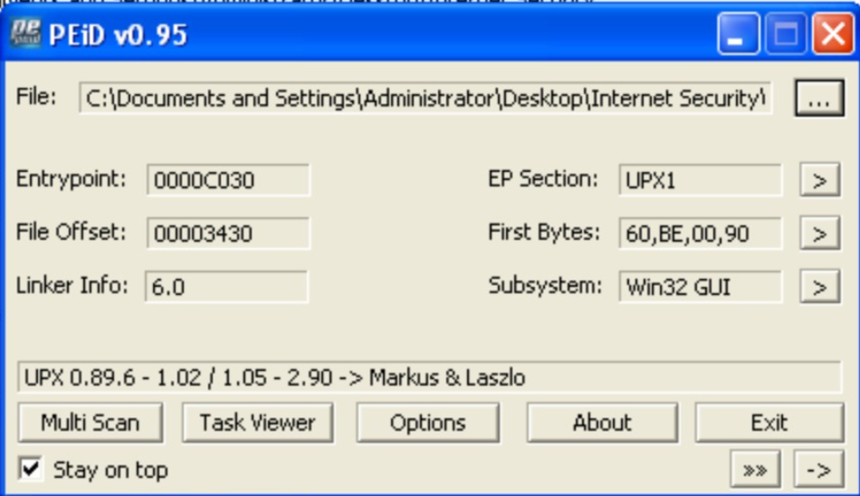
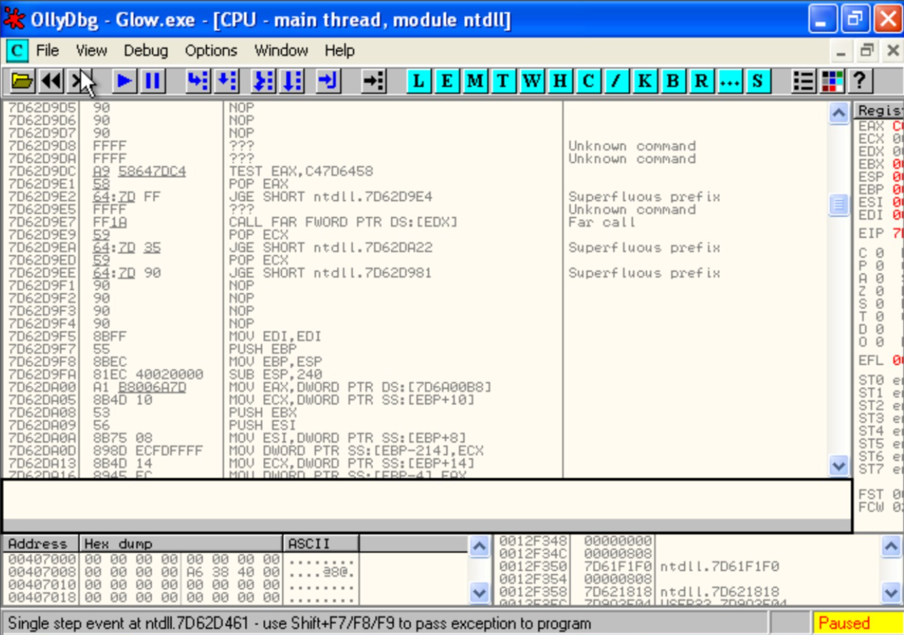

# Case Study- Glow Application Security Analysis 

 ## Introduction
    This document provides an analysis of the Glow application, including findings from examining the Glow.cpp source code and the Glow.exe executable. The analysis highlights a buffer overflow vulnerability discovered during the exploration and debugging process.

 ## Environment Setup
    Operating System: Windows XP (running in a virtual machine)
    Tools Used:
    OllyDbg (Debugger)
    PEiD (Executable Packer/Protector Detector)
    UPX (Ultimate Packer for eXecutables)
    Hex Editors and other standard debugging tools

 ## Steps Followed
    - Analyzing the Executable
    - Using PEiD, it was determined that Glow.exe was packed with UPX.
    
    - The executable was then unpacked using UPX: upx -d "Glow.exe"

 ## Loading and Debugging with OllyDbg
    Glow.exe was loaded into OllyDbg for dynamic analysis. Breakpoints were set at critical functions, particularly those handling user input and string operations.
    

 ## Conclusion
    The Glow application contains a buffer overflow vulnerability in the VerifyPassword function due to improper handling of user input. This vulnerability allows an attacker to crash the application by entering a password longer than the allocated buffer size. Mitigation involves using safer string functions and ensuring proper input validation.