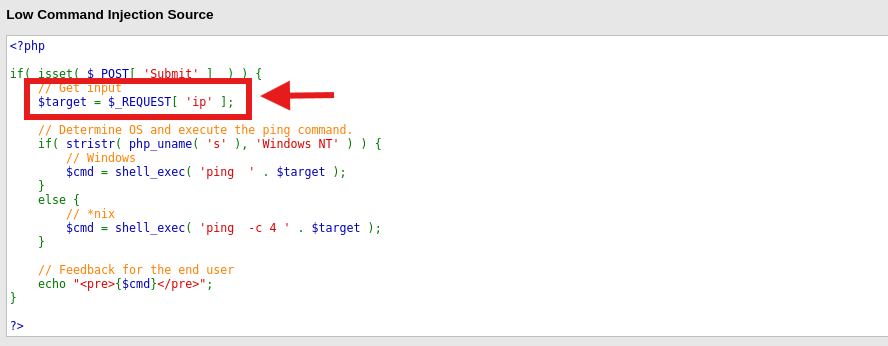

# README: Command Injection and Vulnerability Testing

## Overview

Command injection is a critical security vulnerability that allows attackers to execute arbitrary commands on a host operating system via a vulnerable application. This type of attack occurs when user input is incorrectly handled and included in system commands executed by the application.

In this README, we will explore various command injection scenarios and their implications. We will also provide an analysis of a vulnerable PHP script, `low.php`, to highlight where the issues lie.

## Command Injection Scenarios

| Scenario                             | Description                                                                 | Expected Outcome                                                                                     | Example                                                    |
|--------------------------------------|-----------------------------------------------------------------------------|-----------------------------------------------------------------------------------------------------|------------------------------------------------------------|
| **Basic Command Injection Test**      | Input system commands (e.g., `; ls -a`) into input fields expected to be sanitized. | The system should not execute the commands and should effectively sanitize inputs to prevent execution. | An attacker submits an input such as `127.0.0.1; ls -a` expecting to list directory contents. |
| **Advanced Command Injection with Chaining** | Chain multiple commands using `&&` or `;` to escalate privileges or access system information. | All command chaining attempts should be sanitized. The system should prevent any command execution beyond the intended command. | An attacker inputs `127.0.0.1 && whoami` to try and execute the `whoami` command after the ping. |
| **Command Injection with Obfuscation** | Use encoded or obfuscated commands to bypass simple validation mechanisms. | Encoded or obfuscated commands should not be executed. Input sanitization must handle these cases effectively. | An attacker submits an input such as `127.0.0.1%20;ls%20-la` where `%20` is used to represent a space. |
| **Command Injection via File Upload** | Attempt to upload files with names or contents that are executable commands. | The system should treat file names and contents safely, preventing any command execution. | An attacker uploads a file named `malicious; rm -rf /important_data.txt` and checks if the system processes the file name as a command. |

## Analysis of `low.php`

The following PHP script demonstrates a basic implementation where command injection is a concern:

```php
<?php

if( isset( $_POST[ 'Submit' ]  ) ) {
    // Get input
    $target = $_REQUEST[ 'ip' ];

    // Determine OS and execute the ping command.
    if( stristr( php_uname( 's' ), 'Windows NT' ) ) {
        // Windows
        $cmd = shell_exec( 'ping  ' . $target );
    }
    else {
        // *nix
        $cmd = shell_exec( 'ping  -c 4 ' . $target );
    }

    // Feedback for the end user
    echo "<pre>{$cmd}</pre>";
}

?>
```

## Identified vulnerabilities
Explanation: These lines are vulnerable because they directly incorporate user input ($target) into the shell command without proper validation or escaping. This allows an attacker to inject arbitrary commands. For instance, if an attacker inputs 127.0.0.1; ls -la, the system will execute ping 127.0.0.1 followed by ls -la, potentially exposing sensitive information or causing unintended effects.

Impact: The lack of input sanitization makes the application susceptible to command injection attacks, allowing an attacker to execute arbitrary commands on the server.


## Conclusion
To mitigate command injection vulnerabilities, always validate and sanitize user input, avoid direct inclusion of user input in system commands, and use functions that escape special characters. Proper input handling ensures that the application remains secure against various injection attacks.
